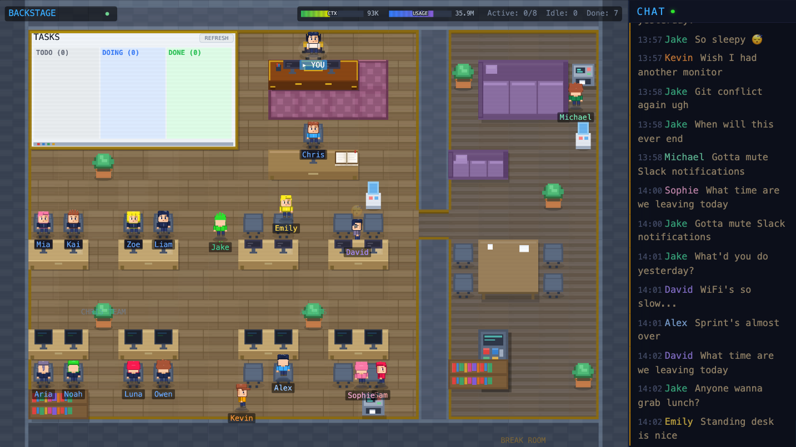
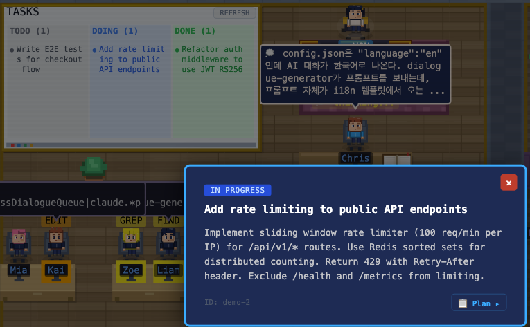
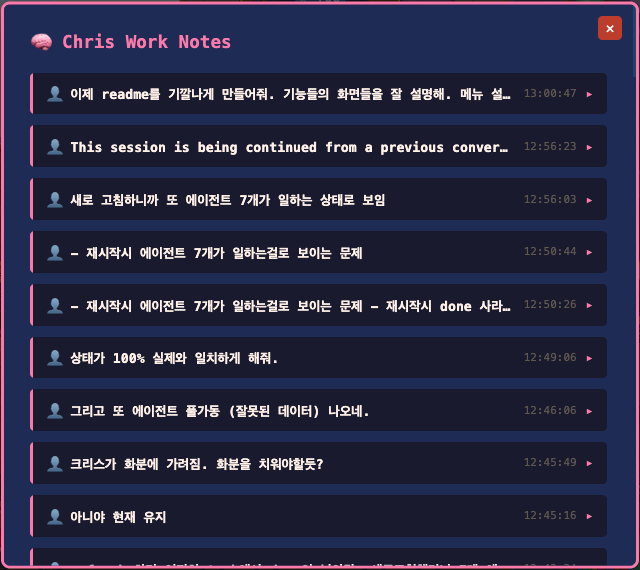
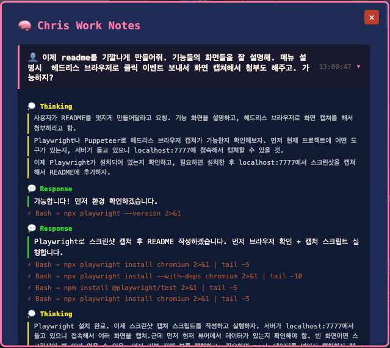
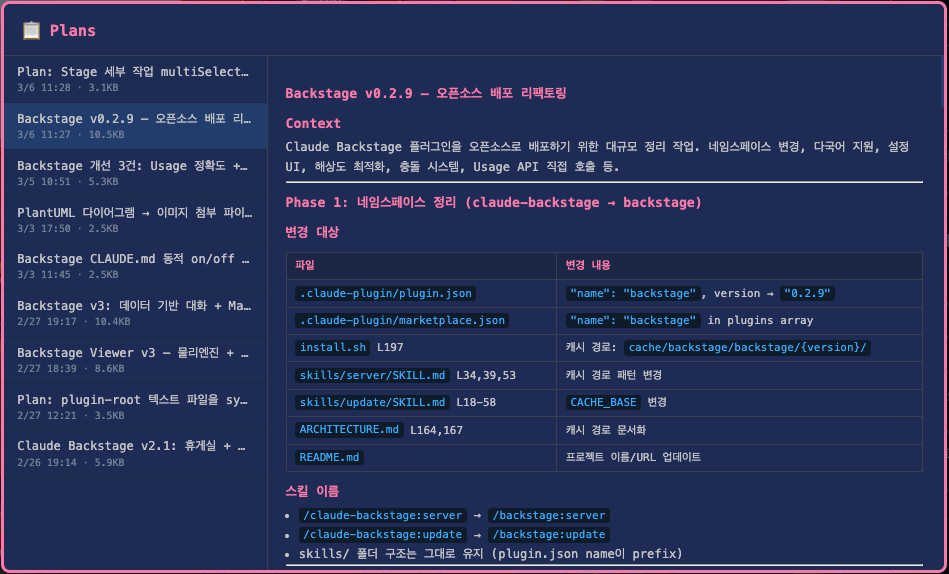

<p align="center">
  
</p>

<h1 align="center">Claude Backstage</h1>

<p align="center">
  <strong>Watch your AI agents work in a Gather Town-style pixel art office</strong>
</p>

<p align="center">
  <a href="#installation">Installation</a> •
  <a href="#features">Features</a> •
  <a href="#how-it-works">How It Works</a> •
  <a href="#characters">Characters</a> •
  <a href="#configuration">Configuration</a> •
  <a href="#architecture">Architecture</a>
</p>

---

**Claude Backstage** is a [Claude Code](https://docs.anthropic.com/en/docs/claude-code) plugin that transforms your terminal AI workflow into a living, breathing pixel art startup office.

When Claude delegates work to sub-agents, each one becomes a character — they walk to their desk, sit down, code away, and head to the break room when they're done. All in real time, all in pixel art.

> Bored between tasks? Wander around the office and press **Spacebar** — your character might have something to say.

---

## Installation

### Prerequisites

| Tool | Purpose |
|------|---------|
| [Claude Code](https://docs.anthropic.com/en/docs/claude-code) | CLI for Claude |
| [Bun](https://bun.sh) | Server runtime |
| [jq](https://jqlang.github.io/jq/) | JSON processing in hooks |

### Option 1: Claude Code Plugin (Recommended)

Add the marketplace and install the plugin:

```bash
claude plugin marketplace add https://github.com/sebyul2/backstage.git
claude plugin install backstage
```

### Option 2: Manual Install

```bash
git clone https://github.com/sebyul2/backstage.git
cd backstage
./install.sh
```

### Start the viewer

In Claude Code, run:
```
/backstage:server on
```

Then open **http://localhost:7777** in your browser. That's it — the office is open for business.

The server starts automatically when you run the command, and shuts down after 10 minutes of inactivity (no browser tabs open).

### Uninstall

```bash
# If installed via plugin system:
claude plugin uninstall backstage

# If installed manually:
./uninstall.sh
```

Removes all plugin files, hooks, cache, and configuration cleanly. No leftovers.

---

## Features

### The Office


The office is split into two zones: the **workspace** on the left and the **break room** on the right, connected by a doorway. Characters navigate around furniture using A* pathfinding, bump into each other (with stun physics!), and idle in the break room between tasks.

The **status bar** at the top shows token usage, API quota, active agent count, and session info at a glance.

The **chat panel** on the right streams everything happening in real time — user requests, agent activity, completions, idle banter, and task updates — all color-coded by character.

---

### Task Dashboard



The dashboard board in the top-left corner tracks all tasks in the current session, organized into **TODO**, **DOING**, and **DONE** columns.

- Click any task to see its **full description** in a detail popup
- Tasks with linked plans show a **Plan** button to jump straight to the plan viewer
- Status updates flow in automatically from Claude's `TaskCreate` / `TaskUpdate` calls
- Hit **Refresh** to clean up completed work and start fresh

---

### Chris Work Notes



Click on **Chris** (the boss character) to open the work notes panel. This is a structured log of your entire Claude session — every user request and the AI's response, organized chronologically.



Expand any entry to see the full detail:

- **Thinking** — Claude's internal reasoning process (the "thought bubbles" you see on Chris)
- **Response** — What Claude actually said back
- **Tool calls** — Every Read, Edit, Bash, Grep call with arguments
- **Sub-agents** — Which agents were spawned and what they did

It's like having a full audit trail of your AI session, presented as your team lead's work diary.

---

### Plan History



The **Plans** panel lets you browse all plans created across sessions — implementation strategies, architecture decisions, refactoring roadmaps.

- Plans are listed on the left with title, date, and file size
- Click any plan to view its **full rendered Markdown** on the right
- Plans persist across sessions, so you can always revisit past decisions

---

### Sub-Agent Characters

Chris doesn't do the work himself. When tasks come in, he delegates to his team — and you get to watch them in action:

1. **Agent spawns** → A character is assigned (Jake, David, Sophie, etc.)
2. **Walks to their desk** → Pathfinding around furniture and other characters
3. **Works** → Speech bubbles show what file they're reading, editing, or searching
4. **Finishes** → Completion message in chat, then they wander to the break room
5. **Idle time** → Characters chat, get coffee, or just hang out until the next task

Chris's **direct team** (C-Team: Mia, Kai, Zoe, Liam, Aria, Noah, Luna, Owen) handles the tool calls that the main agent makes — reading files, running grep, editing code. They sit at their desks on the left side of the office and show exactly what tool is being used and on which file.

> In reality it's all the main Claude agent, but it's way more fun to watch Kai obsess over clean code while Luna worries about security.

---

### AI-Generated Dialogue

When agents complete tasks or use tools, an AI generates natural office banter. Characters react to what's happening — celebrating bug fixes, complaining about technical debt, or just chatting about lunch.

This feature uses `claude --print` with Haiku for fast, cheap dialogue generation. You can turn it on or off:

```bash
# In Claude Code
/backstage:configure
# → Toggle "AI Dialogue" on/off
```

When **off**, characters still move around and work — they just don't chat. The office stays alive, just quieter.

---

## How It Works

```
 You type a prompt
      │
      ▼
 ┌─────────────────────┐
 │  UserPromptSubmit   │──▶ history.jsonl (type: request)
 │  hook               │    → "You" bubble in viewer
 └─────────┬───────────┘
           ▼
 ┌─────────────────────┐
 │  Claude uses tools  │──▶ PreToolUse hook
 │  (Read, Edit, Bash) │    → C-Team characters show work
 └─────────┬───────────┘
           ▼
 ┌─────────────────────┐
 │  Claude spawns      │──▶ Each Agent = a character
 │  sub-agents (Agent) │    → Walks to desk, works, reports
 └─────────┬───────────┘
           ▼
 ┌─────────────────────┐
 │  PostToolUse hook   │──▶ Records completions
 │                     │──▶ Queues AI dialogue generation
 └─────────┬───────────┘
           ▼
 ┌─────────────────────┐
 │  server.ts (Bun)    │──▶ SSE stream to browser
 │  port 7777          │──▶ Transcript → Chris Work Notes
 └─────────┬───────────┘    └▶ Dialogue queue → Haiku
           ▼
 ┌─────────────────────┐
 │  Viewer (Canvas)    │    Pixel art office with
 │  index.html + JS    │    characters, bubbles, chat
 └─────────────────────┘
```

---

## Characters

### The Boss

| Character | Role | What they show |
|-----------|------|----------------|
| **Chris** | Team Lead | Your Claude session — thinking bubbles, responses, decisions. Click to see work notes. |

### Agent Team

When Claude spawns sub-agents, they become these characters (assigned in order, regardless of agent type):

| Character | Personality |
|-----------|-------------|
| **Jake** | 1-year junior, enthusiastic and curious |
| **David** | 10-year senior, cool and concise |
| **Kevin** | Diligent 2nd year, quietly gets things done |
| **Sophie** | Design-focused, loves clean code |
| **Emily** | Detail-oriented, organized |
| **Michael** | Quiet, encyclopedic knowledge |
| **Alex** | Strategic thinker, big picture |
| **Sam** | Thorough, delighted by finding bugs |

> Works with any Claude Code setup — no additional plugins required.

### C-Team (Chris's Direct Reports)

These handle the main agent's tool calls — every Read, Grep, Edit, Bash shows up as one of them working:

| Character | Specialty |
|-----------|-----------|
| **Mia** | Data analysis — gets excited about insights |
| **Kai** | Code craftsman — obsessed with clean code |
| **Zoe** | UX advocate — thinks from user perspective |
| **Liam** | Infrastructure — loves system stability |
| **Aria** | Documentation — makes complex things clear |
| **Noah** | Testing — finds edge cases others miss |
| **Luna** | Security — always thinking about threats |
| **Owen** | Performance — optimizes everything |

Characters are automatically assigned based on agent type. When more agents are needed than main characters available, C-Team members step in.

---

## Configuration

Run `/backstage:configure` in Claude Code to configure:

| Setting | Options | Default | Description |
|---------|---------|---------|-------------|
| **Language** | `en`, `ko` | `en` | UI text, idle chats, tool descriptions |
| **AI Dialogue** | `true` / `false` | `true` | AI-generated character banter on task completion |

Config is stored at `~/.claude/plugins/backstage/config.json`.

### Adding a new language

Create `viewer/i18n/{lang}.json` and `hooks/i18n/{lang}.json` following the existing `en.json` structure, then set `language` in config.

---

## Architecture

```
claude-backstage/
├── .claude-plugin/
│   ├── plugin.json              # Plugin metadata & version
│   └── marketplace.json         # Marketplace listing
├── agents/
│   └── dialogue-generator.md    # AI dialogue generation prompt
├── hooks/
│   ├── hooks.json               # Hook configuration
│   ├── characters.json          # Character definitions & state
│   ├── pre-tool-hook.sh         # PreToolUse — records agent work
│   ├── post-tool-hook.sh        # PostToolUse — completions + dialogue
│   ├── user-prompt-hook.sh      # UserPromptSubmit — user requests
│   ├── stop-hook.sh             # Stop — session end cleanup
│   └── i18n/                    # Hook-side translations
├── skills/
│   ├── server/SKILL.md          # /backstage:server command
│   └── configure/SKILL.md       # /backstage:configure command
├── viewer/
│   ├── server.ts                # Bun SSE server (port 7777)
│   ├── index.html               # Entry point
│   ├── i18n/                    # Client-side translations
│   ├── js/
│   │   ├── main.js              # App bootstrap, SSE, event routing
│   │   ├── engine.js            # Game loop, physics, input
│   │   ├── renderer.js          # Canvas rendering, HUD, furniture
│   │   ├── character.js         # A* pathfinding, collision, movement
│   │   ├── map.js               # Office layout (21×15 tile grid)
│   │   ├── bubble.js            # Speech bubbles
│   │   └── sprite-generator.js  # Procedural sprite generation
│   ├── css/game.css             # Styling + CRT scanline effect
│   └── sprites/                 # Character sprite sheets (.png)
├── install.sh                   # Automated installation
├── uninstall.sh                 # Complete removal
└── ARCHITECTURE.md              # Detailed technical documentation
```

### Tech Stack

| Layer | Technology |
|-------|-----------|
| Server | [Bun](https://bun.sh) + TypeScript |
| Rendering | HTML5 Canvas (no framework) |
| Pathfinding | A* algorithm |
| Communication | Server-Sent Events (SSE) |
| Hooks | Bash + jq |
| AI Dialogue | `claude --print` with Haiku |
| Sprites | Aseprite → PNG sprite sheets |

---

## License

MIT
